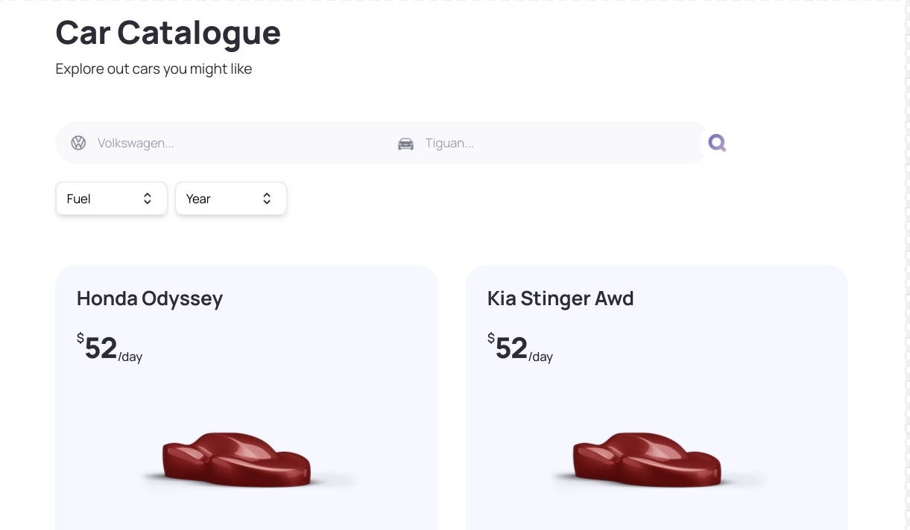
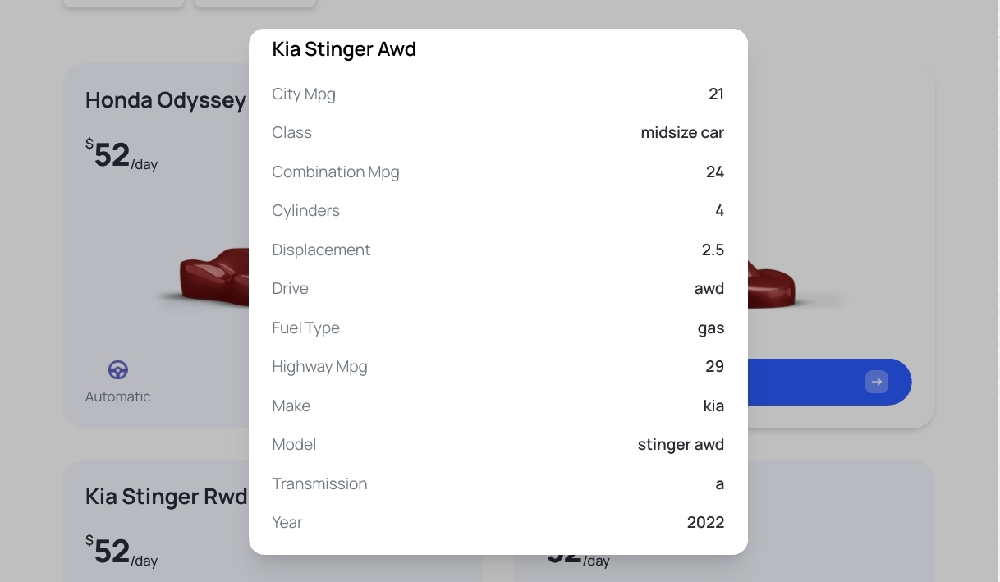
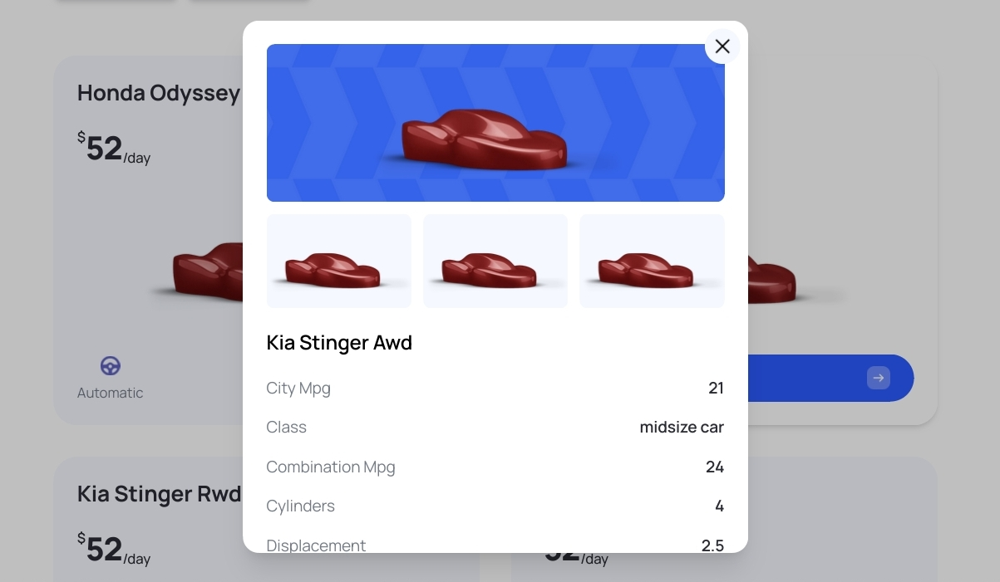
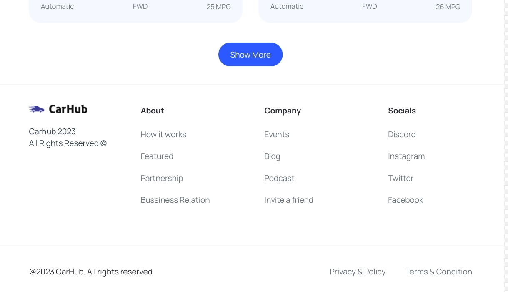

 

# Carhub

Carhub - the Car Showcase website presents various car types, showcasing comprehensive information in a well-designed format with advanced filtering and pagination support for an enhanced user experience.

# Technologies

- Next.js
- TypeScript
- Tailwind CSS

## <a name="features">🔋 Features</a>

👉 **Home Page**: Showcases a visually appealing display of cars fetched from a third-party API, providing a captivating introduction to the diverse range of vehicles available.

👉 **Exploration and Filtering**: Explore a wide variety of cars from around the world, utilizing a search and filter system based on criteria such as model, manufacturer, year, fuel type, and make.

👉 **Transition to Server-Side Rendering**: A seamless transition from client-side rendering to server-side rendering, enhancing performance and providing a smoother browsing experience.

👉 **Pagination**: For easy navigation through a large dataset of cars, allowing users to explore multiple pages effortlessly.

👉 **Metadata Optimization and SEO**: Optimize metadata for car listing, enhancing search engine optimization (SEO) and ensuring better visibility on search engine results pages.

👉 **TypeScript Types**: Utilize TypeScript to provide robust typing for enhanced code quality and better development

👉 **Responsive Website Design**: The website is designed to be visually pleasing and responsive, ensuring an optimal user experience across various devices.

and many more, including code architecture and reusability 

## Screenshots







## Getting Started

To run the project locally, follow these steps:

1. Clone the repository: `git clone <repository_url>`
2. Navigate to the project directory: `cd carhub`
3. Install dependencies: `npm install`
4. add your credentials in `.env`
```env
NEXT_PUBLIC_RAPID_API_KEY=
NEXT_PUBLIC_IMAGIN_API_KEY=hrjavascript-mastery
```
4. Start the development server: `npm run dev`
